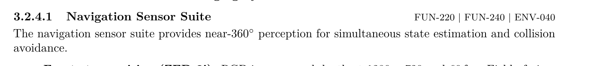
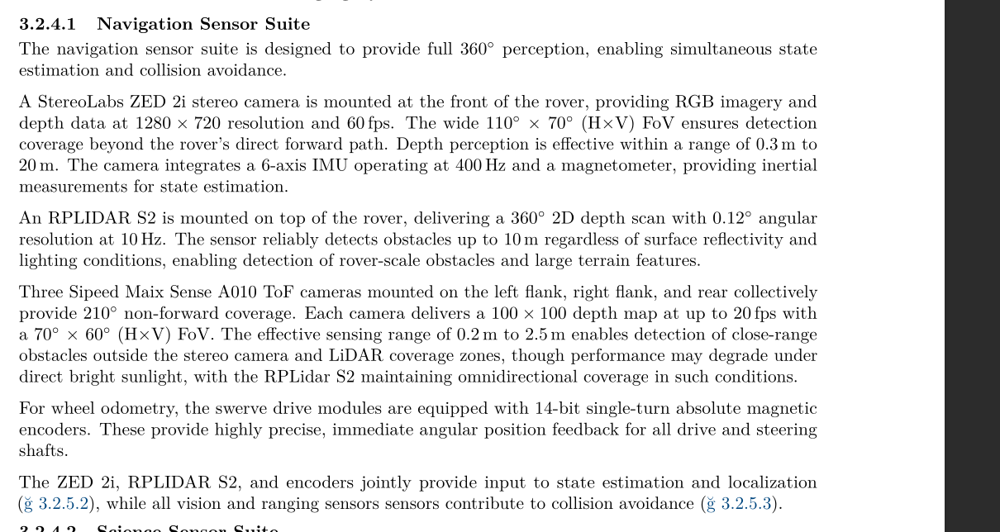
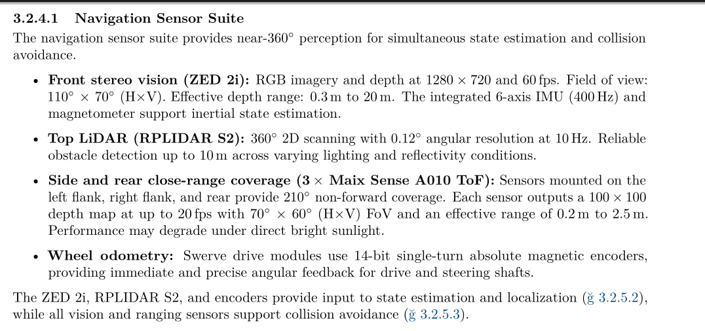
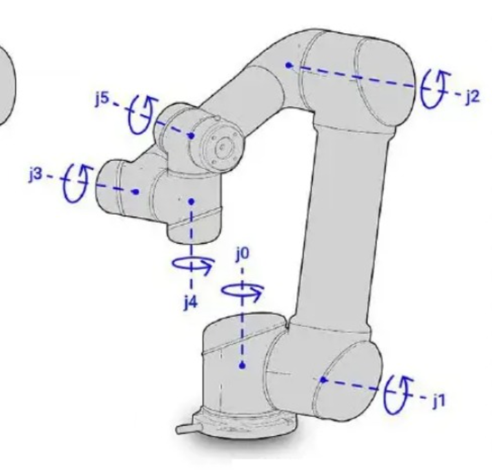
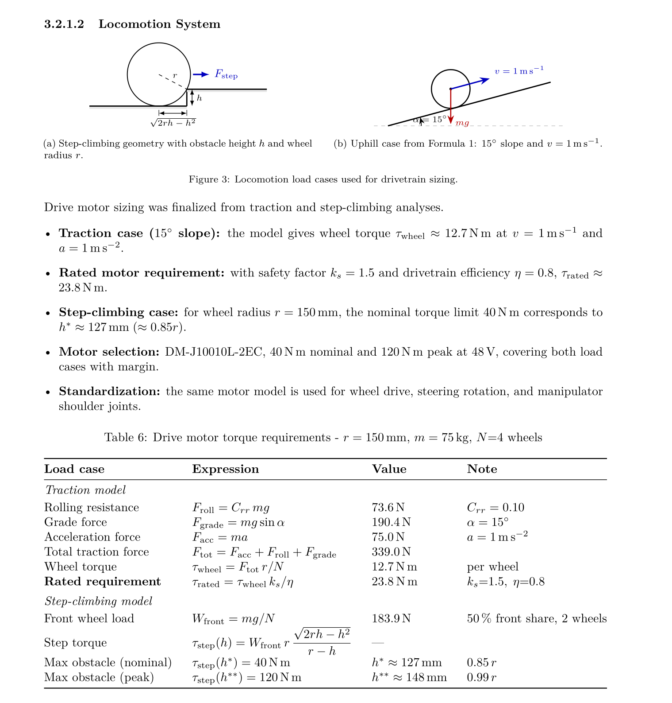

# Оновлення по звіту

## Крок 1: Вказування вимог відповідних до секції

Ніяким чином не згадуйте про вимоги у своїх текстом, в цьому нема абсолютно ніякого сенсу.

Тим більше, тепер до кожної секції буде така примітка з номерами вимог, яку я додам самостійно

*дизайн може мінятись

## Крок 2: приклад переробки секції в булети

Що робимо:
- прибираємо зайву "воду";
- чистимо граматику;
- довгі абзаци розбиваємо на короткі булети.

### Старий текст

### Новий текст

Текст взагалі не втратив сенсу, але став коротшим та легшим для сприйняття

## Крок 3: позбуваємось назв моделей

Я підготую вам таблицю, в якій ви можете внести відповідність між чікою моделлю та спрощеною назвою

https://docs.google.com/spreadsheets/d/1gUwmo4IffuOkeIWymhKEnRl_o5tTnWJfah2tYI8SeHU/edit?usp=sharing

Пізніше з цього буде складено Product tree, де ми загальну назву деталі покажемо разом з моделюю яку ми використовуємо. Таким чином надалі це для читача тотожність, він може по будь якій назві дізнатись точну модель, а ми відповідно не повторюємо її 10 раз на розділ

Приклад: Main Computing Module - Jetson Orin

Таким чином зробимо текст простішим для прийняття та меншим

Якщо модель не вибрана вписуйте: "TBD" - to be defined

## Назви

Будь-що, про що іде мова має бути або зображено на картинці чи малюнку (дуже-дуже бажані варіати), або коротко та якісно описано текстом. Текст може бути сухий, швидкий - поки є якісні зображення

Наприклад: замість пояснень про те, що таке joints, як вони крутяться що таке j1 - j6 і так далі вставте схожу картинку, тільки з підписами де j1 де j6. Ідеальний приклад:

## Формули

Формули не мають займати пів сторінки, особливо якщо це тривіальні формули. Краще це місце витратити на малюнки з поясненням обрахунків(якщо є можливість такі зробити), а формули вставити як тут:

*Це не кінцевий розділ, це просто приклад

## Обрахунки

Обрахунки повинні бути приблизними та ми маємо 
повідомити про їхню приблизність. 
Не деталізуйте кожну деталь, лишайте великий запас, а також прописуйте на скільки відсотків в обидві сторони це число може змінитись.

*Це написано в першу чергу для обрахунку маси марсоходу та дрона

---

## Заберіть детальні описи куплених деталей

Ці деталі КУПЛЕНІ, їхні характеристики не цікавлять суддів
їх цікавить опис нашого марсоходу. Давайте зосереджуватись
на ньому. Можуть бути вийнятки, якщо сумніваєтесь чи варто щось розписувати - кидайте в чат.

Всі речення типу: we selected this model … to do …, в яких нема якоїсь чіткої аналітики і сенсу - видаляємо. Можуть бути вийнятки
